# Diagrama de clases

Generado a partir del código y completado con las relaciones. Visibilidad:
`+` público, `-` privado.
Doble encapsulamiento: cada atributo privado tiene su `get` y su `set`, y la clase
sólo lo usa a través de ellos. Se omiten las interfaces de datos que devuelven las
consultas (`DatosProceso`, `DatosBloque`, `Metricas`, `MetricasMemoria`, `EstadoSistema`).

```mermaid
classDiagram
  direction TB

  class AdministradorMemoria {
    -tamanoTotal: number
    -politica: IPoliticaAsignacion
    -bloques: BloqueMemoria[]
    +getTamanoTotal() number
    -setTamanoTotal(tamano) void
    +getPolitica() IPoliticaAsignacion
    -setPolitica(politica) void
    -getBloques() BloqueMemoria[]
    -setBloques(bloques) void
    +asignarMemoria(pid, tamano) boolean
    -ocuparBloque(bloque, pid, tamano) void
    +liberarMemoria(pid) void
    -unirBloquesLibresVecinos() void
    -buscarBloqueDe(pid) BloqueMemoria | undefined
    +obtenerMapa() DatosBloque[]
    +obtenerMetricas() MetricasMemoria
    -calcularFragmentacion(memoriaLibre, mayorBloque) number
  }

  class BloqueMemoria {
    -inicio: number
    -tamano: number
    -pid: string | null
    +getInicio() number
    -setInicio(inicio) void
    +getTamano() number
    -setTamano(tamano) void
    +getPid() string | null
    -setPid(pid) void
    +getFin() number
    +estaLibre() boolean
    +asignarA(pid, tamanoPedido) BloqueMemoria
    +liberar() void
    +puedeUnirseCon(siguiente) boolean
    +unirCon(siguiente) void
    +obtenerDatos() DatosBloque
  }

  class IPoliticaAsignacion {
    <<interface>>
    +getNombre() string
    +ordenarCandidatos(bloques, tamanoPedido) BloqueMemoria[]
  }

  class IAsignadorMemoria {
    <<interface>>
    +asignarMemoria(pid, tamano) boolean
  }

  class ILiberadorMemoria {
    <<interface>>
    +liberarMemoria(pid) void
  }

  class PoliticaPrimerAjuste {
    +getNombre() string
    +ordenarCandidatos(bloques, tamanoPedido) BloqueMemoria[]
  }

  class IPlanificador {
    <<interface>>
    +encolar(proceso) void
    +actualizarBloqueados() void
    +ejecutarTick() void
    +getCambiosDeContexto() number
    +obtenerProcesoEnCPU() DatosProceso | undefined
    +obtenerListos() DatosProceso[]
    +obtenerBloqueados() DatosProceso[]
    +obtenerTerminados() DatosProceso[]
    +obtenerHistorialCPU() string[]
  }

  class Planificador {
    -quantum: number
    -memoria: ILiberadorMemoria
    -cpu: Proceso[]
    -colaListos: Proceso[]
    -bloqueados: Proceso[]
    -terminados: Proceso[]
    -cambiosDeContexto: number
    -historialCPU: string[]
    +getQuantum() number
    -setQuantum(quantum) void
    -getMemoria() ILiberadorMemoria
    -setMemoria(memoria) void
    -getCpu() Proceso[]
    -setCpu(cpu) void
    -getColaListos() Proceso[]
    -setColaListos(cola) void
    -getBloqueados() Proceso[]
    -setBloqueados(bloqueados) void
    -getTerminados() Proceso[]
    -setTerminados(terminados) void
    +getCambiosDeContexto() number
    -setCambiosDeContexto(cantidad) void
    -getHistorialCPU() string[]
    -setHistorialCPU(historial) void
    +encolar(proceso) void
    +actualizarBloqueados() void
    +ejecutarTick() void
    -despacharSiLaCpuEstaLibre() void
    -decidirQueSigue(proceso) Function
    -finalizar(proceso) void
    -bloquear(proceso) void
    -expulsar(proceso) void
    -liberarCpu() void
    +obtenerProcesoEnCPU() DatosProceso | undefined
    +obtenerListos() DatosProceso[]
    +obtenerBloqueados() DatosProceso[]
    +obtenerTerminados() DatosProceso[]
    +obtenerHistorialCPU() string[]
  }

  class EstadoProceso {
    <<enumeration>>
    NUEVO
    ESPERANDO_MEMORIA
    LISTO
    EJECUTANDO
    BLOQUEADO
    TERMINADO
  }

  class EventoEntradaSalida {
    -disparo: number
    -duracion: number
    +getDisparo() number
    -setDisparo(disparo) void
    +getDuracion() number
    -setDuracion(duracion) void
  }

  class Proceso {
    -pid: string
    -memoriaRequerida: number
    -cpuTotal: number
    -cpuRestante: number
    -estado: EstadoProceso
    -quantumConsumido: number
    -tiempoBloqueoRestante: number
    -eventosES: EventoEntradaSalida[]
    +getPid() string
    -setPid(pid) void
    +getMemoriaRequerida() number
    -setMemoriaRequerida(memoria) void
    +getCpuTotal() number
    -setCpuTotal(cpuTotal) void
    +getCpuRestante() number
    -setCpuRestante(cpuRestante) void
    +getEstado() EstadoProceso
    -setEstado(estado) void
    +getQuantumConsumido() number
    -setQuantumConsumido(quantum) void
    +getTiempoBloqueoRestante() number
    -setTiempoBloqueoRestante(tiempo) void
    -getEventosES() EventoEntradaSalida[]
    -setEventosES(eventos) void
    +getCpuConsumida() number
    +terminoSuCpu() boolean
    +agotoQuantum(limite) boolean
    +tieneEntradaSalidaAhora() boolean
    +terminoSuBloqueo() boolean
    +obtenerDatos() DatosProceso
    +esperarMemoria() void
    +admitir() void
    +despachar() void
    +ejecutarUnTick() void
    +expulsar() void
    +renovarQuantum() void
    +bloquear() void
    +avanzarBloqueo() void
    +desbloquear() void
    +terminar() void
    +programarEntradaSalida(disparo, duracion) void
    -buscarEvento(cpuConsumida) EventoEntradaSalida | undefined
    -buscarEventoActual() EventoEntradaSalida | undefined
    -cambiarEstado(nuevo, permitidosDesde) void
  }

  class ColaDeAdmision {
    -memoria: IAsignadorMemoria
    -planificador: IPlanificador
    -pendientes: Proceso[]
    -getMemoria() IAsignadorMemoria
    -setMemoria(memoria) void
    -getPlanificador() IPlanificador
    -setPlanificador(planificador) void
    -getPendientes() Proceso[]
    -setPendientes(pendientes) void
    +agregar(proceso) void
    +admitirProcesos() void
    +obtenerNuevos() DatosProceso[]
    +obtenerEsperandoMemoria() DatosProceso[]
    -obtenerEnEstado(estado) DatosProceso[]
  }

  class ConfiguracionSimulacion {
    -memoriaTotal: number
    -quantum: number
    -politica: IPoliticaAsignacion
    +getMemoriaTotal() number
    -setMemoriaTotal(memoriaTotal) void
    +getQuantum() number
    -setQuantum(quantum) void
    +getPolitica() IPoliticaAsignacion
    -setPolitica(politica) void
  }

  class IAdmision {
    <<interface>>
    +agregar(proceso) void
    +admitirProcesos() void
    +obtenerNuevos() DatosProceso[]
    +obtenerEsperandoMemoria() DatosProceso[]
  }

  class ISimulador {
    <<interface>>
    +registrarProceso(pid, memoria, cpuTotal) DatosProceso
    +programarEntradaSalida(pid, despuesDeTicksDeCpu, duracion) void
    +avanzarTick() Metricas
    +avanzarTicks(cantidad) Metricas
    +consultarProceso(pid) DatosProceso
    +obtenerMetricas() Metricas
    +obtenerEstado() EstadoSistema
  }

  class Simulador {
    -configuracion: ConfiguracionSimulacion
    -memoria: AdministradorMemoria
    -planificador: IPlanificador
    -admision: IAdmision
    -procesos: Map~string, Proceso~
    -tickActual: number
    -metricas: Metricas
    +getConfiguracion() ConfiguracionSimulacion
    -setConfiguracion(configuracion) void
    -getMemoria() AdministradorMemoria
    -setMemoria(memoria) void
    -getPlanificador() IPlanificador
    -setPlanificador(planificador) void
    -getAdmision() IAdmision
    -setAdmision(admision) void
    -getProcesos() Map~string, Proceso~
    -setProcesos(procesos) void
    +getTickActual() number
    -setTickActual(tick) void
    -getMetricas() Metricas
    -setMetricas(metricas) void
    +registrarProceso(pid, memoria, cpuTotal) DatosProceso
    +programarEntradaSalida(pid, despuesDeTicksDeCpu, duracion) void
    +consultarProceso(pid) DatosProceso
    -buscarProceso(pid) Proceso
    +avanzarTick() Metricas
    +avanzarTicks(cantidad) Metricas
    +obtenerMetricas() Metricas
    +obtenerEstado() EstadoSistema
    -calcularMetricas() Metricas
  }

  class ErrorDominio {
    +ErrorDominio(mensaje)
  }

  ISimulador <|.. Simulador : realiza
  Simulador *-- "1" ConfiguracionSimulacion
  Simulador *-- "1" AdministradorMemoria
  Simulador *-- "1" IPlanificador
  Simulador *-- "1" IAdmision
  Simulador o-- "0..*" Proceso : procesos
  Error <|-- ErrorDominio

  IAdmision <|.. ColaDeAdmision : realiza
  ColaDeAdmision o-- "0..*" Proceso : pendientes
  ColaDeAdmision --> "1" IAsignadorMemoria : memoria
  ColaDeAdmision --> "1" IPlanificador : planificador

  IPlanificador <|.. Planificador : realiza
  Planificador o-- "0..*" Proceso : colaListos / bloqueados / terminados
  Planificador o-- "0..1" Proceso : cpu
  Planificador --> "1" ILiberadorMemoria : memoria

  IAsignadorMemoria <|.. AdministradorMemoria : realiza
  ILiberadorMemoria <|.. AdministradorMemoria : realiza
  AdministradorMemoria *-- "1..*" BloqueMemoria : bloques
  AdministradorMemoria --> "1" IPoliticaAsignacion : politica
  ConfiguracionSimulacion --> "1" IPoliticaAsignacion : politica

  IPoliticaAsignacion <|.. PoliticaPrimerAjuste : realiza

  Proceso --> "1" EstadoProceso : estado
  Proceso *-- "0..*" EventoEntradaSalida : eventosES
```

